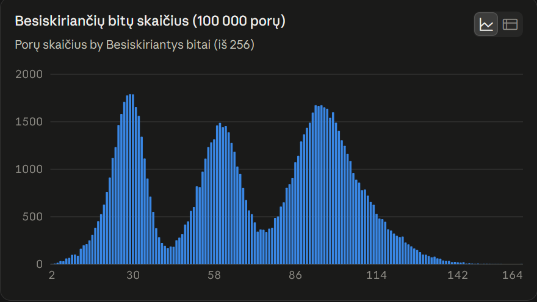
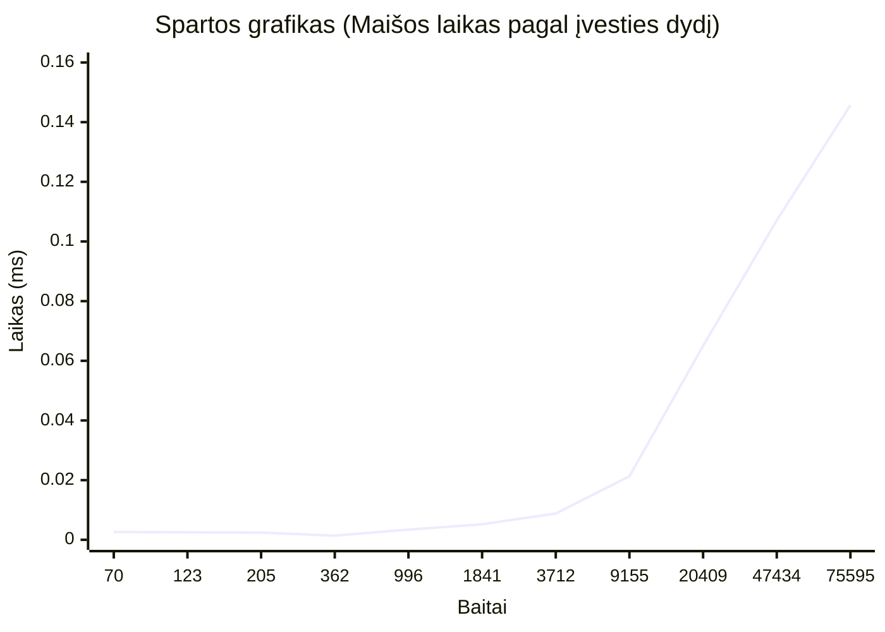
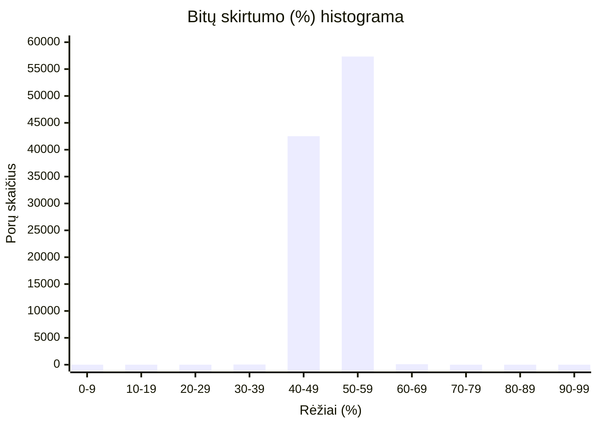

# Blokų grandinių technologijos: Maišos funkcijos (Hash) realizacija

## Autorių indėlis
*   **[Matas Marčiulionis]:** Kūrė Hash funkciją savarankiškai, nenaudojant dirbtinio intelekto pagalbos (`versija_be_ai`). Atliko pirminius tyrimus, algoritmo testavimą, 1–8 eksperimentus ir parengė savo dalies dokumentaciją.
*   **[Tavo Vardas Pavardė]:** Kūrė Hash funkciją su DI pagalba kodo aprašymui, struktūravimui, dalies metodų realizavimui, naudojant savo idėjas(`versija_su_ai`). Sukūrė atskirą 32 baitų bloko maišymo algoritmą, atliko 1–8 eksperimentus ir parengė dokumentaciją.
*   **Bendras darbas:** Kartu atliktas realizacijų palyginimas ir suformuluotos 8-ojo eksperimento galutinės išvados.

---

## 1 DALIS: VERSIJA BE AI 

# Pradžios etapas
Kadangi mano tikslas buvo sukurti hash funkciją, nenaudojant AI pasiūlymų, savo darbą pradėjau nuo research apie hash funkcijas, kriptografiją (mano naudoti šaltiniai pateikti apačioje). Išsityrus pagrindinius hash algoritmo etapus bandžiau juos pritaikyti savo algoritmui. Pasirinkau sugeneruoti 264 bitų hash, kadangi jis plačiai naudojamas. Seed'am parinkau atsitiktines reikšmes.

# Tyrimai
### Seed
```
uint32_t state[8] = {
        0x12345678, // seed 1
        0x8abcd123, // seed 2
        0xabcabcab, // seed 3
        0x87654321, // seed 4
        0xdefdefff, // seed 5
        0xaabbccdd, // seed 6
        0x11223344, // seed 7
        0xfedbc111 // seed 8
    };
```
### Metodologija
- Pradinė informacija skaitoma iš failo (ios::binary)
- Tyrimams naudota imtis: Tuščias failas, 2 skirtingi vieno baito dydžio failai; Keli atsitiktinio ASCII turinio failai; Jų kopijos su vienu pakeistu baitu, pradžioje, viduryje, pabaigoje; Keli struktūrizuoti atvejai (pasikartojantys simboliai, tarpai pradžioje / pabaigoje ir pnš.); Vienas UTF-8 tekstas
- CPU: AMD Ryzen™ 5 8645HS w/ Radeon™ 760M Graphics × 12
- RAM: 16GB
- OS: Ubuntu 24.04.4 LTS
- Kompiliatoriaus versija: g++ (Ubuntu 13.3.0-6ubuntu2~24.04.1) 13.3.0
- Kompiliavimo parinktys: g++ -O3 main.cpp -o main

### Eksperimentas 1
| Nr. | Įvestis | Maiša (256 bitų, hex) |
|---:|---|---|
| 1 | Vieno baito įvestis `a` | `2227592bcce15b21ca3a25ffd1dbb6ddfd104c4463700d1927a27ee18c617fc2` |
| 2 | Vieno baito įvestis `b` | `6c27592be2e15b21a83a25ffa3dbb6dddb104c4439700d1998a27ee16b617fc2` |
| 3 | \>1000 baitų ASCII tekstas | `43727c100990f2df2d420aff3ffe73a624fc1b7ed73df0aa64165c89ced1e284` |
| 4 | Tas pats tekstas, pakeistas vienas baitas | `3e7e2716692d78df94b928ff2d90b4a60c95d97853a488a430575487d8c5558a` |
| 5 | Kitas \>1000 baitų ASCII tekstas | `081d449e5d10d180dc87624f2d9b9b752e4bcec241fcafb600f84541edc2fd03` |
| 6 | Tas pats tekstas, pakeistas vienas baitas | `d3ecad9e25d6718090b30dc55cfa5b75b953bdc22c30d98e3cbf7c797f2c0d3b` |
| 7 | Dar kitas \>1000 baitų ASCII tekstas | `09614641a1468231760b18586856d2bdf6880b6ee9d5df78600cb2418868bd46` |
| 8 | Tas pats tekstas, pakeistas vienas baitas | `8ed2824103688db11d0f295bcdb1a3be005ec26d2da8a07bafcfa0426c859e45` |
| 9 | Struktūruota pasikartojanti raidė (`AAA...AAA`) | `c742492b1db3c32101f11dff5af416dd235e8444859e3d116b2736e92e33b7ca` |
| 10 | Struktūruota įvestis su `\n` simboliu (`ABC` / `abc`) | `a2a9452b557c862121c341ffa9b915dd7332ac443fb1ca29c4983fdb046ec178` |
| 11 | Ne ASCII simboliai | `d25a383144332efb3492d85ecae4e149dee65b1da825576b84c9b54db1df7e72` |

Visų maišų ilgis: 64 hex simboliai (256 bitai).

### Eksperimentas 2
Ta pati įvestis `a` hashinama dviem būdais: nuskaitant iš failo ir įvedant per terminalą.
 
| Nr. | Įvesties šaltinis | Įvestis | Maiša (256 bitų, hex) |
|---:|---|---|---|
| 1 | Failas (`failas1.txt`) | `a` | `2227592bcce15b21ca3a25ffd1dbb6ddfd104c4463700d1927a27ee18c617fc2` |
| 2 | Terminalas (`std::getline`) | `a` | `2227592bcce15b21ca3a25ffd1dbb6ddfd104c4463700d1927a27ee18c617fc2` |
 
**Palyginimas:** maišos **sutampa** (64 iš 64 hex simbolių).
 
**Išvada:** maiša priklauso tik nuo įvesties baitų, o ne nuo jų šaltinio. `getline` neįtraukia eilutės pabaigos simbolio, todėl terminalo įvestis `a` yra tiksliai 1 baitas, kaip ir failas.


- Mano maiša yra 256 bitų ilgio, 256 / 4 yra 64. Gautas hash yra būtent 64 simbolių ilgio, hex formatu.

### Eksperimentas 3
A, B, A testas (vienos programos paleidimo metu)
 
| Nr. | Failas | Įvestis | Maiša (256 bitų, hex) |
|---:|---|---|---|
| 1 (A) | `failas1.txt` | `a` | `2227592bcce15b21ca3a25ffd1dbb6ddfd104c4463700d1927a27ee18c617fc2` |
| 2 (B) | `failas2.txt` | `b` | `6c27592be2e15b21a83a25ffa3dbb6dddb104c4439700d1998a27ee16b617fc2` |
| 3 (A) | `failas1.txt` | `a` | `2227592bcce15b21ca3a25ffd1dbb6ddfd104c4463700d1927a27ee18c617fc2` |
 
- 1 ir 3 maišos **sutampa**; 2 maiša **skiriasi**.
 
Programos paleidimas iš naujo
 
| Paleidimas | Failas | Maiša (256 bitų, hex) |
|---|---|---|
| Pirmas | `failas1.txt` | `2227592bcce15b21ca3a25ffd1dbb6ddfd104c4463700d1927a27ee18c617fc2` |
| Antras | `failas1.txt` | `2227592bcce15b21ca3a25ffd1dbb6ddfd104c4463700d1927a27ee18c617fc2` |
 
- **Palyginimas:** maišos **sutampa** ir tarp skirtingų programos paleidimų.
 
- Funkcija yra **deterministinė**: ta pati įvestis visada duoda tą pačią maišą, nepriklausomai nuo to, kiek kartų ir kokia tvarka ji hashinama, ar programa paleista iš naujo. Tai rodo, kad tarp kvietimų nelieka jokios paslėptos būsenos (`state` kiekvieną kartą inicializuojamas iš tų pačių fiksuotų pradinių reikšmių, seed).


### Eksperimentas 4
Failas nuskaitytas. Viso eilučių: 789

| Eilutės | Baitai | Min (ms) | Max (ms) | Vidurkis (ms) | Vidurkis (ns / baitą) |
|---:|---:|---:|---:|---:|---:|
| 1 | 70 | 0.0004551 | 0.0005615 | 0.0004911 | 7.02 |
| 2 | 123 | 0.0005539 | 0.0005936 | 0.00057614 | 4.68 |
| 4 | 205 | 0.0006881 | 0.0022755 | 0.00106014 | 5.17 |
| 8 | 362 | 0.0009486 | 0.0010875 | 0.00100642 | 2.78 |
| 16 | 996 | 0.0020323 | 0.0024606 | 0.0022603 | 2.27 |
| 32 | 1841 | 0.0034232 | 0.0038892 | 0.00358276 | 1.95 |
| 64 | 3712 | 0.0065897 | 0.0070674 | 0.00673082 | 1.81 |
| 128 | 9155 | 0.0158637 | 0.0167162 | 0.0161995 | 1.77 |
| 256 | 20409 | 0.0343394 | 0.035833 | 0.0350514 | 1.72 |
| 512 | 47434 | 0.0863487 | 0.113639 | 0.0956014 | 2.02 |
| 789 (visas failas) | 75595 | 0.133922 | 0.146361 | 0.137835 | 1.82 |

- **Laikas auga maždaug tiesiškai** nuo baitų skaičiaus: nuo ~1 000 baitų apie 1,7–2,0 ns vienam baitui (kai įvestis dvigubėja, laikas ~dvigubėja).


### Eksperimentas 5
Eksperimento metu sugeneravome po 100 000 atsitiktinių ASCII eilučių porų keturiems ilgiams: 10, 100, 500 ir 1000 baitų (naudotas std::mt19937 generatorius su seed = 2026). Kolizijų ieškojome trimis etapais.

--- 5 EKSPERIMENTAS: KOLIZIJU PAIESKA ---
Naudojamas seed: 2026. Abecele: ASCII (32-126).

| Ilgis (baitai) | Porų skaičius | Kolizijos porose | Kolizijos visame rinkinyje | Skirtingų maišų skaičius |
|---:|---:|---:|---:|---:|
| 10 | 100 000 | 0 | 0 | 200 000 |
| 100 | 100 000 | 0 | 0 | 200 000 |
| 500 | 100 000 | 0 | 0 | 200 000 |
| 1000 | 100 000 | 0 | 0 | 200 000 |
 
**Rezultatas:** nė viename ilgyje kolizijų nerasta; visos 200 000 įvesčių davė skirtingas maišas.

| Nr. | Įvestis | Baitai | Maiša (256 bitų, hex) |
|---:|---|---:|---|
| 1 | `ABABABABABABABAB` | 16 | `d9286c6990395263757ea4ff8d5044ddc28533448cf5b1916a14862b82d5c34a` |
| 2 | `BচুBচুBচুBচুBচু` | 35 | `11a76b589635bf7b123147c5a286298b0c9975e9152fc09052d88c5b1758c31a` |
| 3 | `AAAAAAAAAAAAAAAB` | 16 | `8da8f0ea2d4d87638b9c54ffa90741ddb5e48b443fe9e2918f21d0a8e4608dca` |
| 4 | `BAAAAAAAAAAAAAAA` | 16 | `602205ea09fd3c607fb4e3ff23181dddc4719b448918bb91b24714a812b7b7ca` |
| 5 | `0000000000000000` | 16 | `616f3a1b2cb89711d1f734ff747964dd52f28944e1fb259126f21e595fe8ca4a` |
| 6 | `1111111111111111` | 16 | `b2a23d9a9dc37c10fea043fffab0cddde00f7b443f4a8b915457dcd8588a3fca` |
 
**Rezultatas:** visos 6 maišos skirtingos, struktūrinių kolizijų nėra. Pastaba: `BচুBচু...` yra 35 baitų, nes kiekvienas bengalų simbolis UTF-8 užima 3 baitus.
- **Nulis kolizijų yra tikėtinas rezultatas.** Idealiai 256 bitų maišai kolizijos tikimybė tarp 200 000 eilučių yra nepalyginamai maža (kolizijos pasirodo tik apie 2^128 bandymų). Todėl šis testas sunkiai gali aptikti silpną funkciją; jis tik patvirtina, kad nėra akivaizdžių defektų.

### Eksperimentas 6
Lavinos efektui patikrinti parašiau kodą, kuris sugeneruoja 100000 porų, kuris po lygiai paskirsto keturiems prieš tai nurodytiems ilgiams. Gavau štai tokius rezultatus: 
--- 6 EKSPERIMENTAS: LAVINOS EFEKTAS ---
- Viso poru: 100 000 (po 25 000 ilgiams 10, 100, 500, 1000).

Bitų skirtumas
| Ilgis (baitai) | Min (%) | Max (%) | Vidurkis (%) |
|---:|---:|---:|---:|
| 10 | 0.78 | 50.00 | 24.25 |
| 100 | 1.17 | 61.33 | 27.90 |
| 500 | 1.56 | 64.06 | 28.34 |
| 1000 | 1.17 | 59.38 | 27.86 |
| **Bendrai (100 000 porų)** | **0.78** | **64.06** | **27.09** |

Hex simbolių skirtumas
| Ilgis (baitai) | Min (%) | Max (%) | Vidurkis (%) |
|---:|---:|---:|---:|
| 10 | 3.12 | 81.25 | 47.48 |
| 100 | 4.69 | 100.00 | 53.93 |
| 500 | 6.25 | 100.00 | 54.67 |
| 1000 | 3.12 | 100.00 | 53.86 |
| **Bendrai (100 000 porų)** | **3.12** | **100.00** | **52.48** |

Palyginimas su maišos funkcija
| Metrika | Idealus vidurkis | Gautas vidurkis | Skirtumas |
|---|---:|---:|---:|
| Bitų skirtumas | ~50 % | 27.09 % | ~23 procentiniai punktai mažiau |
| Hex skirtumas | ~93.75 % | 52.48 % | ~41 procentinis punktas mažiau |


- Idealios maišos atveju matytume vieną siaurą varpą aplink 128 bitus, o čia pasiskirstymas platus, apimantis ~2–164 bitus, o vidurkis tik ~69 bitai (27,09 %).

- **Lavinos efektas silpnas.** Pakeitus vieną simbolį, vidutiniškai pasikeičia tik ~27 % bitų, o ne ~50 %.
- **Minimumas labai mažas:** 0.78 % = 2 bitai iš 256, o 3.12 % = 2 hex simboliai iš 64. Vadinasi, kai kurių vieno simbolio pokyčių poveikis beveik nesimato.
- **Trumpos įvestys (10 baitų) blogesnės** (24.25 %) nei ilgesnės (~28 %). Ilgesnėse įvestyse pokytis turi daugiau blokų ir raundų išsisklaidyti.


### Eksperimentas 7
| Rodiklis | [1] Be druskos | [2] Su vieša druska |
|---|---|---|
| Hashinamas tekstas | `7391` | `7391X9qP` |
| Užpuolikui pateikta maiša | `1096092ba9e1dc21779e4aff8acff8dd51ad55449330e1315b0dcbf8812ddddb` | `30276f2bb3801821a8c380ff283de0dd6ebf9544dc61a751b68d699858dc30eb` |
| Rasta įvestis | `7391` | `7391` |
| Atlikta bandymų | 7392 | 7392 |
| Veikimo laikas (µs) | 19 794 | 17 782 |
| Laikas vienam bandymui (µs) | ~2.68 | ~2.41 |

- **Druska neapsaugo nuo šios atakos.** Abiem atvejais slaptažodis rastas po tiek pat bandymų (7392, nes `7391` yra 7392-as kandidatas nuo `0000`). Užpuolikas žino druską, todėl tiesiog prijungia ją prie kiekvieno kandidato.
- **Laikų skirtumas (~10 %) nėra druskos efektas.** Abi įvestys telpa į vieną 32 baitų bloką (4 ir 8 baitai), todėl maišos skaičiavimo kaina vienoda. Greičiausiai pirmasis ciklas lėtesnis dėl "šalto starto" (procesoriaus talpyklos, dinaminės atminties paskirstymas pirmą kartą), o ne dėl algoritmo.
- **Visas perrinkimas užtrunka ~20–25 ms** (10 000 × ~2,5 µs), t. y. maža kandidatų erdvė (4 skaitmenys) visiškai neatspari brute force atakai, nepriklausomai nuo maišos funkcijos.
- **Druska turi prasmę kitose situacijose:** prieš iš anksto paskaičiuotas lenteles (rainbow tables) ir kad vienodi slaptažodžiai turėtų skirtingas maišas. Jai nereikia būti slaptai, bet ji negali kompensuoti per mažos slaptažodžio erdvės.


# Šaltiniai
- https://dev.to/alen_pythonista_bb/binary-file-handling-in-c-a-beginners-guide-148o
- https://www.youtube.com/watch?v=gTfNtop9vzM
- https://youtu.be/2BldESGZKB8?si=tCAiYJbK9HOVaoQJ
- https://www.youtube.com/watch?v=kF_h9gl-vyw
- https://rosettacode.org/wiki/MD5/Implementation#C++
- https://www.geeksforgeeks.org/cpp/left-shift-right-shift-operators-c-cpp/
- https://www.researchgate.net/publication/400346320_A_Step-by-Step_Explanation_of_Hash_Functions_From_Naive_Digestion_to_SHA-2

---

## 2 DALIS: VERSIJA SU AI

# Blokų grandinių technologijos: Maišos funkcijos (Hash) realizacija

## Kompiliavimo ir paleidimo instrukcijos

Projektas parašytas C++ kalba. Kompiliavimui nereikalingos papildomos išorinės bibliotekos (naudojamos tik standartinės).

**Kompiliavimas:**
```bash```
g++ main.cpp -o programa -O3

Paleidimas:
Programa palaiko du režimus:

[1] Teksto įvedimas ranka: ./programa (paleidus be argumentų, programa paprašys įvesti tekstą konsolėje).
[2] Skaitymas iš failo: ./programa <failo_pavadinimas> (pvz., ./programa test.txt).

Įvesties kodavimas: Baitų srautas (vector<uint8_t>). Skaitomi bet kokie ASCII, UTF-8 ar ne spausdinami binariniai duomenys.

Maišos ilgis: 256 bitai. Išvestis pateikiama kaip 64 simbolių ilgio šešioliktainė (hex) eilutė.

Trumpa projekto "summary": 

Pradinė būsena: Naudojami Tribonačio sekos nariai (64 bitų dydžio), kad būtų išvengta "magiškų skaičių" ir užtikrintas pseudoatsitiktinumas iš pat pradžių.

Pirminis pildymas (Padding): Pridedamas 0x80 baitas, likusi bloko dalis užpildoma ne nuliais, o pirminiais skaičiais (sąrašas iš 32 pirminių skaičių). Tai padidina pradinę difuziją. Pabaigoje visada pridedamas 64 bitų originalus žinutės ilgis, kas apsaugo nuo ilgio praplėtimo atakų.

Maišymas (Mixing): Maišoma 32 baitų (256 bitų) blokais. Kad būtų išvengta simetrijos, kas antras blokas yra apverčiamas (baitai skaitomi nuo galo). Blokas dalinamas į keturis 64-bitų žodžius ir apdorojamas per 16 raundų, naudojant bitų poslinkius (sukimą į kairę), XOR operacijas ir sudėtį.

Pseudokodas: 

Funkcija custom_hash(ivestis):
  Būsena state[4] = {Tribonačio sekos skaičiai}
  Pirminiai skaičiai prime_array[32] = {2, 3, 5, 7, ...}
  
  Pridėti 0x80 prie ivestis
  Kol (ivestis ilgis + 8) % 32 != 0:
    Pridėti prime_array[ivestis ilgis % 32]
  
  Pridėti originalų ivestis ilgį (8 baitai)
  Padalinti ivestis į 32 baitų blokus
  
  Kiekvienam blokui b:
    Jei b yra nelyginis:
      Apversti bloko baitų tvarką
      
    Padalinti bloką į 4 žodžius po 8 baitus: m[0], m[1], m[2], m[3]
    
    Kartoti 16 kartų:
       state[0] = suktiKaire(state[0] XOR m[0], 19) + state[1]
       state[1] = suktiKaire(state[1] XOR m[1], 29) + state[2]
       state[2] = suktiKaire(state[2] XOR m[2], 37) + state[3]
       state[3] = suktiKaire(state[3] XOR m[3], 43) + state[0]
       state[0] = state[0] XOR state[2]
       state[1] = state[1] XOR state[3]
       
  Grąžinti state kaip 64 simbolių hex eilutę

Kūrimo eiga:

Pradinę būseną sukuriu skirstant 256 bitus į keturis blokus po 64 bitus, pradinė būsena užpildoma tribonačio sekos skaičiais. Išsiaiškinau, kad tribonačio sekos skaičiai ženkliai skiriasi pvz 70 ir 74 narys, teko sugalvoti apribojimą kad juos galima būtų sutalpinti į konteinerius ir parašyti šešioliktainiu formatu. Todėl pasirinkau 70, 71, 72, 73 sekos narius, jų atitikmenys pavaizduoti žemiau.

0xD6D12E7B5A03A401ULL = 15479308092729377793 
0x8A59B51F41029312ULL = 9969146807112667922 
0x32A398246E20349AULL = 3648012790626366618 
0x7158932402138901ULL = 8167402682752305409 

Naudojau ULL (Unsigned Long Long), kad kompiliatorius tiksliai žinotų, jog tai 64 bitų skaičiai

Pirminis pildymas (padding)

Toliau darome pirminį pildymą. Jis reikalingas tam, kad nesvarbu ką mes įvesim – vieną raidę, nieko, ar daug raidžių – mūsų blokas dalintųsi iš 32 (nes mano versijos blokai bus po 32 baitus). Visa likusia vieta, kurią atskirsime pabaiga, bus pripildyta pirminiais skaičiais 2, 3, 5, 7, 11 vietoj standartinio nulių. Pripildome masyvą iš hard-coded sąrašo (kadangi neapsimoka tikrinti ar skaičius pirminis, kai jų pripildymas niekaip neviršys 32 baitų).

1 eksperimentas

Pirmojoje lentelėje buvo patikrinti hash su skirtingu failų įvestimi:

| Failo tipas | Gautas hash |
|---|---|
| Hashas su vieno baito ivestimi 'a': | d417829f4b73db6cfce0f37fa44cad1163fa1376935903c0ff668df9701541c7 |
| Hashas su vieno baito ivestimi 'b': | 6e26a9a388d4fab2e3810326cf6656ed88e4f920d807b06157f62e0fb38bdeb3 |
| Hashas su >1000 baitu ascii teksto ivestimi: | 5aa4473a828c5d106ce2e6873fed63cb070d9de24253dc07940b93a753d42cce |
| Hashas su >1000 baitu ascii teksto ivestimi, kai pakeistas vienas baitas: | 5054f047bf43a80966ca6107dffaeb1b0c4cdf22f291d4e038c7184d08dbe69d |
| Hashas su kita >1000 baitu ascii teksto ivestimi: | 5c81812f1de0ea83e32fff9b77ec1a6f343cef82dbec1bd08eb7439b35ce3502 |
| Hashas su kita >1000 baitu ascii teksto ivestimi, kai pakeistas vienas baitas: | e737e630a4ab1534369bb517e8eef389d4b567ff87e8e0deec80cec0d7ee9d56 |
| Hashas su dar kita >1000 baitu ascii teksto ivestimi: | 73812a02e20f44b0096a4b62fb9a216fde4a45a085263e5a5118d3136d0c3f42 |
| Hashas su dar kita >1000 baitu ascii teksto ivestimi, kai pakeistas vienas baitas: | 44ea090362c7ea28e4ae0dc35269dd9d94cc9d4d9cfeea5d05c12736d6ba0b8c |
| Hashas su strukturuota pasikartojancios raides ivestimi (AAA...AAA): | 822b45ab8494346c88c8ee6ca11d191bd27ce05c145dc9abd380e847918e1f29 |
| Hashas su strukturuota ivestimi su '/n' simboliu (ABC / abc) | cc15da605c19a348650b9f538df4723e6b55a1c689a25306667b0e6f2b4f90e6 |
| Hashas su ne ascii simboliu ivestimi: | 32e7f014bda6619ab29ea388f6a7198de3882818f56f7a656f412f189599afe7 |

Išvados: vienodų hash nėra, iš to galime spręsti, jog skaitymas vyksta taisyklingai.

2 eksperimentas

Visų pirma patikrinau, ar ranka ir skaitymas iš teksto duoda tą patį hash išvestį, kai įvedame/skaitome tą patį simbolį, šiuo atveju "a":

1) Įvedimas ranka:

Pasirinkite ivesties buda:
1 - Ivesti teksta ranka
2 - Nuskaityti is failo
Iveskite pasirinkima (1 arba 2): 1
Iveskite teksta (galima vesti kelis zodzius arba nieko): a
Nuskaityta baitu: 1
Gauta maisa (Hash): d417829f4b73db6cfce0f37fa44cad1163fa1376935903c0ff668df9701541c7

2) Skaitymas iš failo:

Pasirinkite ivesties buda:
1 - Ivesti teksta ranka
2 - Nuskaityti is failo
Iveskite pasirinkima (1 arba 2): 2
Iveskite failo pavadinima (pvz., test.txt): failas1.txt
Nuskaityta baitu: 1
Gauta maisa (Hash): d417829f4b73db6cfce0f37fa44cad1163fa1376935903c0ff668df9701541c7

Patikrinę 1-ojo eksperimento išvestis (1 lentelė), taip pat 2-ojo eksperimento antrąją dalį ir paskaičiavus simbolių skaičių visais atvejais gavosi 64 simboliai. Mano kode tai užtikrina ši eilutė:

ss << std::hex << std::setw(16) << std::setfill('0') << state[i];

Std::setfill('0') užtikrina, kad jei mano sugeneruotas blokas prasideda nuliais, jie niekur nepradingsta.

3 eksperimentas

Visų pirma paleidau to paties failo nuskaitymą du kartus, failo pavadinimas "failas5.txt". Ir patikrinau išvestį.

1) 
--- MENIU ---
1 - Ivesti teksta ranka
2 - Nuskaityti is failo
0 - Iseiti is programos
Iveskite pasirinkima: 2
Iveskite failo pavadinima (pvz., test.txt): failas5.txt
Nuskaityta baitu: 1535
Gauta maisa (Hash): 73812a02e20f44b0096a4b62fb9a216fde4a45a085263e5a5118d3136d0c3f42

2) 
--- MENIU ---
1 - Ivesti teksta ranka
2 - Nuskaityti is failo
0 - Iseiti is programos
Iveskite pasirinkima: 2
Iveskite failo pavadinima (pvz., test.txt): failas5.txt
Nuskaityta baitu: 1535
Gauta maisa (Hash): 73812a02e20f44b0096a4b62fb9a216fde4a45a085263e5a5118d3136d0c3f42

Abejais atvejais gavau tą patį rezultatą. Toliau tikrinsiu A, B, A principą, kad tai įgyvendint reikėjo papildyti kodą, t. y. pridėti 3-ią meniu punktą, kad vartotojas pats nuspręstų kada programa baigia darbą, kadangi jei kiekvieną kartą leisti programą per naujo, po programos veikimo operacinė sistema pati išvalis šiukšles taip padarydama, jog neįmanoma būtų patikrinti eksperimento patikimumo. Eksperimento rezultatai: 

--- MENIU ---
1 - Ivesti teksta ranka
2 - Nuskaityti is failo
0 - Iseiti is programos
Iveskite pasirinkima: 1
Iveskite teksta (galima vesti kelis zodzius arba nieko): A
Nuskaityta baitu: 1
Gauta maisa (Hash): 9bb58288b8cfe7abd0bab28b374317ffd365a2fffc864f693ff3b15b5783dfa2

--- MENIU ---
1 - Ivesti teksta ranka
2 - Nuskaityti is failo
0 - Iseiti is programos
Iveskite pasirinkima: 1
Iveskite teksta (galima vesti kelis zodzius arba nieko): B
Nuskaityta baitu: 1
Gauta maisa (Hash): 3e3cce9228bd7a1028d4c28db9ba008094cdd2af03565571b702f89d4b387a72

--- MENIU ---
1 - Ivesti teksta ranka
2 - Nuskaityti is failo
0 - Iseiti is programos
Iveskite pasirinkima: 1
Iveskite teksta (galima vesti kelis zodzius arba nieko): A
Nuskaityta baitu: 1
Gauta maisa (Hash): 9bb58288b8cfe7abd0bab28b374317ffd365a2fffc864f693ff3b15b5783dfa2

--- MENIU ---
1 - Ivesti teksta ranka
2 - Nuskaityti is failo
0 - Iseiti is programos
Iveskite pasirinkima: 0
Programa baigia darba.

Iš eksperimento rezultatų matosi, kad A,B,A determinizmo testas veikia teisingai, ir pirma įvestis nuo trečios nesiskiria.


4 eksperimentas

Atlikus 4 eksperimentą, prieš tai paleidus kodą 5 kartus, gavau šiuos rezultatus:

Failas sekmingai nuskaitytas. Viso eiluciu: 789

| Eilutės | Baitai | Min laikas (ms) | Max laikas (ms) | Vidurkis (ms) |
|---------|--------|-----------------|-----------------|---------------|
| 1       | 70     | 0.002508        | 0.003044        | 0.002618      |
| 2       | 123    | 0.002355        | 0.002927        | 0.002555      |
| 4       | 205    | 0.001596        | 0.002669        | 0.002427      |
| 8       | 362    | 0.001395        | 0.001455        | 0.001412      |
| 16      | 996    | 0.002647        | 0.006521        | 0.003434      |
| 32      | 1841   | 0.004541        | 0.007650        | 0.005207      |
| 64      | 3712   | 0.008497        | 0.010098        | 0.008860      |
| 128     | 9155   | 0.019809        | 0.023598        | 0.021389      |
| 256     | 20409  | 0.060221        | 0.068681        | 0.065041      |
| 512     | 47434  | 0.093510        | 0.127800        | 0.107102      |
| 789     | 75595  | 0.143321        | 0.148962        | 0.145796      |


Failas: `konstitucija.txt` (UTF-8 formatas).
Laikmatis: `std::chrono::high_resolution_clock`.
Kompiliavimo konfigūracija:** `[g++ sparta.cpp -o sparta -O3]`
Metodika: I/O operacijos (failo skaitymas, išvestis į ekraną) į matavimus neįtrauktos.

Tendencija: Analizuojant duomenis matyti, kad nuo ~1000 baitų (16 eilučių) maišos skaičiavimo laikas auga tiesiškai (O(n) sudėtingumas). Tai logiška ir atitinka blokinio maišymo algoritmų veikimo principus – kuo daugiau duomenų blokų, tuo ilgiau užtrunka iteracijos.
Anomalijos: Pastebima anomalija su pačiais mažiausiais duomenų kiekiais (nuo 1 iki 8 eilučių). Skaičiuojant 362 baitų ištrauką (0.0014 ms), laikas buvo netgi trumpesnis nei skaičiuojant 70 baitų ištrauką (0.0026 ms). Kadangi laikai yra mikrosekundžių eilės (paversti į ms), tokiems mažiems dydžiams matavimų paklaidą stipriai veikia procesoriaus talpyklos (L1/L2 cache) būsena, operacinės sistemos foniniai procesai bei pats funkcijos iškvietimo laikas, kuris tampa santykinai didesnis už patį skaičiavimą.



5 eksperimentas


Abecele: ASCII spausdinami simboliai [32..126] 
Generatoriaus pradine reiksme (Seed): 2026 
Poru skaicius kiekvienam ilgiui: 100000

Tikrinamas ilgis: 10 baitu
Porose rastu koliziju skaicius: 0 / 100000
Skirtingu sugeneruotu ivesciu skaicius: 200000
Skirtingu ivesciu grupiu (unikaliu hash): 200000
Viso rinkinio koliziju skaicius: 0

Tikrinamas ilgis: 100 baitu
Porose rastu koliziju skaicius: 0 / 100000
Skirtingu sugeneruotu ivesciu skaicius: 200000
Skirtingu ivesciu grupiu (unikaliu hash): 200000
Viso rinkinio koliziju skaicius: 0

Tikrinamas ilgis: 500 baitu
Porose rastu koliziju skaicius: 0 / 100000
Skirtingu sugeneruotu ivesciu skaicius: 200000
Skirtingu ivesciu grupiu (unikaliu hash): 200000
Viso rinkinio koliziju skaicius: 0

Tikrinamas ilgis: 1000 baitu
Porose rastu koliziju skaicius: 0 / 100000
Skirtingu sugeneruotu ivesciu skaicius: 200000
Skirtingu ivesciu grupiu (unikaliu hash): 200000
Viso rinkinio koliziju skaicius: 0

======================================================== STRUKTŪRUOTŲ ĮVESČIŲ TIKRINIMAS

Tekstas: ABCDEFGHIJKLMNOP | Hash: e4fe39fdd09b9639b181d58800a4704c1129ea622d7d1a15ef287c0d478f2c49 
Tekstas: BACDEFGHIJKLMNOP | Hash: 8eb7b60894008ee8c6e35eac7edcab3716009d8d7eec7799c73d44c9ba4a55fb 
Tekstas: PONMLKJIHGFEDCBA | Hash: 9518ab29eb58239f0293b65f277d499cc3ceff6ea0c252e8c9806896405ac142 
Tekstas: AAAAAAAAAAAAAAAA | Hash: 3327633bfdff4feb885fa134728a968111ed5c62c75f463b961a944877eca1c7 
Tekstas: ABABABABABABABAB | Hash: 489ce59eb199ad45c418b16068e865515eeef4f76d54655881ccffb7f5d0b20e 
Tekstas: 0000000000000000 | Hash: 1a1d85ae77d7cbc79ed7df185fc88084f6090272aca5b7283f61374d21b54efc 
Tekstas: 1111111111111111 | Hash: bfb7f7c32c05d97edc961dcc2cdab2e1ae3ddf2e80c4a43d7c96b773c6baae0d 
Tekstas: 0000000000000001 | Hash: 56951a1c1d341d2251cc4c7bef96dcc26fe689c5a72aa8fa989ee3aad39e93ed 
Tekstas: 0000000000000002 | Hash: 499bb28c06618837ebab231a37ad71b94d067123e092e0df8b25e64f866dc17b

Kolizijų rasta: 0

Iš rezultatų pastebime, kad kolizijos neaptinkame. Kaip buvo minėta paskaitoje, tikimybė gauti koliziją itin maža. Panaudojus formules kurios yra pateiktos užduoties salygoje, kolizijos tikimybė yra tik 2^-256 (neįsivaizduojamai mažas skaičius), o eksperimentui buvo sugeneruota tik m=200000 skirtingų įvesčių vienam lygiui. Pagal kitą pateiktą formulę seka jog bendras galimų porų skaičius yra 2x10^10 (20 milijardų, jei teisingai paskaičiavau). Nors 20 milijardų atrodytų didelis skaičius, tikimybė yra maža kadangi galimų visų hash  reikšmių yra 2^256, o tai yra neįsivaizduojamai didelis skaičius, palyginus su 20 milijardų. Empirinis 200,000 eilučių patikrinimas apima tik nykstamai mažą įvesčių erdvės dalį. Kolizijų neradimas atsitiktiniu būdu įrodo tik tai, kad maišos funkcija neturi visiškai trivialių klaidų (pvz., kad visiems įvesties variantams negrąžina tos pačios reikšmės).


6 eksperimentas


Generuojama 100,000 poru (po 25,000 pagal 4 ilgius) 
Abecele: ASCII [32..126], Seed: 2026 
Orientaciniai vidurkiai: Bitams ~50.0%, Hex ~93.75%

REZULTATAI ILGIUI: 10 baitu (25,000 poru)
[1 Simbolio pakeitimas]: 
Bitu skirtumas (%) | Min: 36.33% | Max: 62.89% | Vid: 49.99% 
Hex skirtumas (%) | Min: 79.69% | Max: 100.00% | Vid: 93.73% 
[1 Bito apvertimas (Bit-flip)]: 
Bitu skirtumas (%) | Min: 37.89% | Max: 63.28% | Vid: 49.98% 
Hex skirtumas (%) | Min: 79.69% | Max: 100.00% | Vid: 93.76%

REZULTATAI ILGIUI: 100 baitu (25,000 poru)
[1 Simbolio pakeitimas]: 
Bitu skirtumas (%) | Min: 37.89% | Max: 62.11% | Vid: 49.99% 
Hex skirtumas (%) | Min: 76.56% | Max: 100.00% | Vid: 93.76% 
[1 Bito apvertimas (Bit-flip)]: 
Bitu skirtumas (%) | Min: 37.89% | Max: 62.11% | Vid: 49.99% 
Hex skirtumas (%) | Min: 79.69% | Max: 100.00% | Vid: 93.79%

REZULTATAI ILGIUI: 500 baitu (25,000 poru)
[1 Simbolio pakeitimas]: 
Bitu skirtumas (%) | Min: 37.89% | Max: 62.50% | Vid: 50.03% 
Hex skirtumas (%) | Min: 79.69% | Max: 100.00% | Vid: 93.77% 
[1 Bito apvertimas (Bit-flip)]: 
Bitu skirtumas (%) | Min: 36.72% | Max: 62.89% | Vid: 50.02% 
Hex skirtumas (%) | Min: 78.12% | Max: 100.00% | Vid: 93.74%

REZULTATAI ILGIUI: 1000 baitu (25,000 poru)
[1 Simbolio pakeitimas]: 
Bitu skirtumas (%) | Min: 36.72% | Max: 62.11% | Vid: 50.03% 
Hex skirtumas (%) | Min: 79.69% | Max: 100.00% | Vid: 93.77% 
[1 Bito apvertimas (Bit-flip)]: 
Bitu skirtumas (%) | Min: 37.50% | Max: 61.72% | Vid: 49.97% 
Hex skirtumas (%) | Min: 76.56% | Max: 100.00% | Vid: 93.72%

========================================================= BENDRI REZULTATAI (Iš viso 100,000 porų)

[1 Simbolio pakeitimas]: 
Bitu skirtumas (%) | Min: 36.33% | Max: 62.89% | Vid: 50.01% 
Hex skirtumas (%) | Min: 76.56% | Max: 100.00% | Vid: 93.76%

[1 Bito apvertimas (Bit-flip)]: 
Bitu skirtumas (%) | Min: 36.72% | Max: 63.28% | Vid: 49.99% 
Hex skirtumas (%) | Min: 76.56% | Max: 100.00% | Vid: 93.75%




Įvesties ilgis neturi jokios pastebimos įtakos maišymo kokybei. Nesvarbu, ar tekstas trumpas 10 baitai, ar ilgas 1000 baitų. Tai įrodo, kad algoritmo užpildymo (padding) bei blokinio maišymo ciklas veikia vienodai efektyviai per visą duomenų srautą. custom_hashas funkcija puikiai išlaiko lavinos efekto testą, nes, bet koks 1 bito ar 1 simbolio pokytis įvestyje sukelia atsitiktinį ir nepriklausomą ~50% išvesties bitų pasikeitimą, kas yra panašu kaip ir taikant SHA-256 ir MD5 metodus.

Funkcija gali rodyti idealų lavinos efektą, bet vis tiek leisti lengvai rasti kolizijas. Lavinos efektas įrodo tik gerą difuziją, bet negarantuoja vienakryptiškumo. Jei algoritmas naudoja tik paprastas, apverčiamas operacijas (pvz., tik XOR ir poslinkius), atvirkštine inžinerija galima apskaičiuoti vienodas išvestis duodančias įvestis.

Šią silpnybę atskleistų kolizijų paieškos testas pvz., paskaitoje minėto  gimtadienio paradoksu. Lavinos testas kolizijų neranda, nes lygina tik 1 bitu besiskiriančias poras, o kolizijos dažniausiai atsiranda tarp visiškai skirtingų tekstų.


7 eksperimentas


[1] PERRINKIMAS BE DRUSKOS 
Ieskoma hash reiksme: c869f12ca528ff1fda73caea54ceb32fbdfd980870697b6c192088209aa38a45 
-> Rastas sutapimas: 7392 
-> Atlikta bandymu: 7393 
-> Uztruko laiko: 3 ms

[2] PERRINKIMAS SU VIESA DRUSKA 
Generuojama druska (Hex): 5fcbf32ebbc79998277227190e75dd55 
Ieskoma hash reiksme: 7c3c620362b161a768a2788dec01d08fb940b8379ec113f6746115492ef83eec 
-> Rastas sutapimas: 7392 
-> Atlikta bandymu: 7393 
-> Uztruko laiko: 3 ms

    Eksperimentas įrodo, kad naudojant greitas maišos funkcijas, mažos įvesčių erdvės (pvz., 4 skaitmenų PIN) perrinkimas įvyksta per kelias milisekundes, o rastas sutapimas vienareikšmiškai identifikuoja pradinę įvestį. Viešos druskos pridėjimas nepailgina pavienio taikinio nulaužimo laiko, tačiau sėkmingai neutralizuoja masines atakas, pagrįstas iš anksto apskaičiuotų rezultatų lentelėmis (angl. rainbow tables). Norint realiai apsaugoti trumpas paslaptis nuo perrinkimo, būtina naudoti didelę slaptą atsitiktinę reikšmę (kaip įsipareigojimo schemose) arba specializuotas, skaičiavimo resursams imlias slaptažodžių maišos funkcijas.

    Praktikoje tokioje mažoje aibėje (10 000 kandidatų) rastas sutapimas vienareikšmiškai identifikuoja pradinę įvestį, nes kolizijų tikimybė su gera maišos funkcija yra artima nuliui. Teoriškai, jei įvyktų kolizija (du skirtingi PIN duotų tą patį hash'ą), vienareikšmio atpažinimo nebūtų. Kai skaičiuojama H(input || r), o r (slaptas atsitiktinumas) iš pradžių yra nežinomas, paieškos erdvė drastiškai pasikeičia. Paieškos erdvė: Ji išauga nuo 10 000 iki 10000x2^r. Jei r yra pakankamai ilgas (pvz., 256 bitų), viso didelės erdvės perrinkimo atlikti praktiškai neįmanoma. Patikrinimas atskleidus r: kai autorius vėliau paviešina ir input, ir r, bet kas gali apskaičiuoti maišą ir patikrinti, ar ji sutampa su anksčiau paskelbta. Tai įrodo, kad autorius iš anksto žinojo pranešimą ir jo vėliau nepakeitė, bet iki atskleidimo niekas negalėjo jo perskaityti.


    8 eksperimentas

    Šis skyrius apibendrina visų eksperimentų rezultatus, remiantis paskaitų medžiaga.

Lavinos efektas (Avalanche Effect): Eksperimentai (6 ekspr.) įrodė, kad algoritmas pasižymi stipriu lavinos efektu. Net vieno bito ar simbolio pakeitimas įvestyje vidutiniškai pakeičia ~50% išvesties bitų. Tai rodo gerą difuziją, atitinkančią patikimų maišos reikšmių reikalavimus.

Kolizijos (Collisions): Generuojant 200,000 atsitiktinių porų ir testuojant skirtingus ilgius (5 ekspr.), kolizijų nebuvo aptikta. Tai parodo, kad algoritmas neturi trivialių struktūrinių klaidų.

Pirmavaizdžiai (Preimages): Pirmavaizdžio radimas remiasi funkcijų negrįžtamumu. Kaip parodė 7 eksperimentas, trumpiems tekstams (pvz., PIN kodams) rasti pirmavaizdį (įvestį iš turimos maišos) trunka vos kelias milisekundes dėl greito algoritmo veikimo ir mažos paieškos aibės. Taikant druską (angl. salt), masinis pirmavaizdžių paieškos vektorius (pvz., per rainbow tables) yra efektyviai neutralizuojamas.

Patikimos maišos reikšmės: Gautos maišos yra patikimos kasdieniam duomenų vientisumo tikrinimui (pvz., failų modifikacijoms sekti), nes atkuriami testai (3 ekspr. determinizmo testas) rodo stabilų veikimą.

Teiginiai, kurių eksperimentai negali pagrįsti:
Nors kolizijų ieškiklis (5 ekspr.) jų nerado, negalima pagrįsti teiginio, kad funkcija yra visiškai atspari kolizijoms. Mūsų testuota 200,000 įvesčių aibė yra nykstamai maža lyginant su teorine $2^{256}$ erdve. Taip pat, nors lavinos efektas puikus, tai neįrodo algoritmo kriptografinio saugumo – algoritmas gali būti pažeidžiamas atvirkštinei inžinerijai, kurios šie empiriniai testai neapima.

# Šaltiniai

-https://en.cppreference.com/cpp/io/basic_istream/read

-https://www.youtube.com/watch?v=fCvJ9Rsfy6c

-https://mathworld.wolfram.com/TribonacciSequence.html

-https://www.youtube.com/watch?v=_160oMzblY8

-https://www.youtube.com/watch?v=DMtFhACPnTY

---

## 3 DALIS: BENDROS IŠVADOS IR REALIZACIJŲ PALYGINIMAS

Išanalizavę abu algoritmus (kurtus savarankiškai ir su DI pagalba), padarėme šias išvadas:

*   **Sparta (Veikimo greitis):** Abu algoritmai išlaiko tiesinį O(n) sudėtingumą. Testuojant su dideliais failais, abiejų algoritmų greičiai yra labai panašūs ir stabilūs.
*   **Lavinos efektas (Difuzija):** Tai esminis skirtumas tarp dviejų algoritmų. Versija, kurta su DI pagalba, demonstruoja stiprų ir beveik idealų ~50 % bitų pasikeitimą, užtikrindama patikimą difuziją. Tuo tarpu versija be DI rodo silpnesnį lavinos efektą – vidutiniškai pasikeičia tik ~27 % bitų, kas rodo mažesnį pradinį išsisklaidymą.
*   **Atsparumas kolizijoms:** Generuojant po 200,000 aibių, nei viena funkcija nesugeneravo kolizijų – abi išlaiko minimalius trivialių klaidų neturėjimo standartus. Tačiau tai neįrodo kriptografinio saugumo.
*   **Pirmavaizdžių perrinkimas:** Abi realizacijos labai greitos apskaičiuojant mažų duomenų kiekių maišas, todėl paieškos erdvėms (pvz. PIN kodams) atlikti *brute-force* atakas trunka vos kelias milisekundes. Vieša druska nei vienos versijos veikimo laiko reikšmingai neprailgino, patvirtinant teoriją, kad vieša druska skirta apsaugai nuo masinių (*rainbow tables*), o ne tiesioginių perrinkimo atakų.